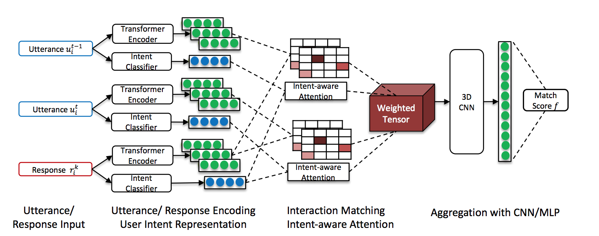

[](https://opensource.org/licenses/MIT)

# __IART: Intent-aware Response Ranking with Transformers in Information-seeking Conversation Systems__

This is the source code of the IART model (Intent-aware Response Ranking with Transformers), which is proposed for multi-turn response selection in the retrieval-based conversation systems.

IART is built on top of the integration of user intent modeling and
language representation learning with the Transformer architecture,
which relies entirely on a self-attention mechanism instead of recurrent
 nets. It incorporates intent-aware utterance attention to derive an
 importance weighting scheme of utterances in conversation context with
  the aim of better conversation history understanding. IART is
   published in WWW 2020. Please find our [paper](https://arxiv.org/pdf/2002.00571.pdf)
    for more details of this model.

## __Network__

IART is built on the top of the [DAM](https://github.com/baidu/Dialogue/tree/master/DAM) model. The
model incorporates intent-aware utterance attention to derive the
importance weighting scheme of different context utterances. Given input
 context utterances and response candidates, we first generate representations from two different perspectives: user intent representations with a
 trained neural classifier and semantic information encoding with Transformers. Then self-attention and cross-attention matching will be performed over
  encoded representations from Transformers to  extract matching features.
  These matching features will be weighted by the intent-aware attention mechanism and aggregated into a matching tensor. Finally a two-layer 3D convolutional neural network will distill final representations over
  the matching tensor and generate the ranking score for the conversation context/ response candidate pair. The main difference between IART and
   DAM is that we explicitly define and model user intent in conversations.
   We show that the intent-aware attention mechanism can help improve response ranking in conversations.

<div align=center>

</div>

## __Usage__

First, please download data from this [Google Drive folder](https://drive.google.com/drive/folders/1iQugGNiLopseGdT-kuKbgR8vxDjsfXRf?usp=sharing) and
unzip it:

```
unzip data.zip
```

Train and test the model by:
```
sh run.sh
```

## __Data Preprocessing__

The code for data preprocessing is in the folder IART/conqa. The input data format is

```
label \t context (utterances separated by \t) \t response.
```

 To generate the pkl data files used for model training/testing, you need to firstly run the script conqa/data_preprocess_dam.py to do data preprocessing. After that you need to run the script conqa/transfer_mz_to_dam_format.py to transfer the preprocessed data in MatchZoo model format to the input data format of DAM/IART model.

The user intent feature vectors output by the user intent classifier are stored in a separate input text file. The format of the user intent vector should be

```
UtteranceID_or_ResponseID \t intent_vector (12 dimensional real value vector for MS/UDC)
```

The utterance ID is in the format context_query_id-utterance_position. For example:

```
Q494819-0  \t   0.77854055 0.005579375 0.012071793 0.1426655 0.04516567 0.01410749 0.045949493 0.32732058 0.021191863 0.052890584 0.019807862 0.06566066
Q494819-1  \t   0.07301873 0.106960244 0.17646718 0.061297048 0.45176902 0.31784177 0.051918026 0.21009733 0.11450306 0.5177668 0.1812782 0.118079714
Q494819-2  \t  0.20212053 0.1563704 0.16760118 0.102229066 0.356528 0.31535488 0.081880495 0.28093183 0.11076649 0.46562743 0.18301935 0.16115002
D464632  \t  0.0762779 0.0095357755 0.046223667 0.018178586 0.00872361 0.0409651 0.0002578992 0.3250671 4.5165205e-05 0.5883033 0.06031314 0.0021345518
D464633  \t 0.08268682 0.09142208 0.17887363 0.12554155 0.10471701 0.15151422 0.020252429 0.4203747 0.019151673 0.4006856 0.20331828 0.064555936
D464630   \t 0.047641575 0.05804358 0.10583141 0.048851516 0.09105808 0.18841337 0.010175006 0.52949446 0.0072372677 0.38212296 0.13627377 0.037408095
```

Q* denotes context utterances. D* denotes response candidates
The following script can help you generate this vector file
conqa/gen_user_intent_vector.py. You can also modify this script or write your own scripts to transfer the intent feature vectors for your own data sets to this format.

## __Further Instructions on Training/Testing IART__

The main scripts for training/testing IART model based on UDC and [MSDialog](https://ciir.cs.umass.edu/downloads/msdialog/) data are main_udc.py and main_ms_v2.py respectively. With the right setting on the model configuration, you can start the model training based on [MSDialog](https://ciir.cs.umass.edu/downloads/msdialog/) data by running

```
python main_ms_v2.py
```

* Set intent_vec_path as the path of the intent features vector file you use.
* Set intent_size as the number of different intent (12 for UDC and MS)
* Set intent_attention_type as bilinear for IART-bilinear, as dot for IART-dot, as outprod for IART-outerproduct
* Set model_name as iadam-attention
* Set data_name, data_path, save_path, word_embed_init, vocab_size, embed_size, batch_size, max_turn_num, max_turn_len, _EOS_ according to the specific setting of your own data sets.

For model testing, you need to additionally set init_model as the path of the best model checkpoint file from your trained model.

## __Example Model Training Output__

```
.....
       [finish building valid batches
       2021-04-17 14:24:46
       ('batch_size: ', 32)
       ('total number of batches in one epoch: ', 312)
       configurations:
       {'vocab_size': 167983, 'intent_vec_path': '../data/ms_v2/intent_vectors.txt', 'data_name': 'ms_v2', 'intent_loss_weight': 0.2, 'emb_size': 200, 'is_mask': True, 'train_steps': 1560, 'drop_attention': None, 'word_emb_init': None, 'print_step': 3, 'save_path': '../output/ms_v2/temp/', 'max_turn_num': 6, 'is_positional': False, 'data_path': '../data/ms_v2/data_small.pkl', 'init_model': None, '_EOS_': 167983, 'learning_rate': 0.001, 'intent_attention_type': 'bilinear', 'rand_seed': None, 'drop_dense': None, 'batch_size': 32, 'final_n_class': 1, 'intent_size': 12, 'intent_ffn_od1': 64, 'intent_ffn_od0': 128, 'attention_type': 'dot', 'cnn_3d_oc0': 16, 'cnn_3d_oc1': 16, 'max_turn_len': 200, 'num_scan_data': 5, 'max_to_keep': 1, 'save_step': 31, 'is_layer_norm': True, 'stack_num': 4, 'model_name': 'iadam-attention'}
       model sucess
       2021-04-17 14:24:46
       ('current turn_index : ', 0)
       ('current turn_index : ', 1)
       ('current turn_index : ', 2)
       ('current turn_index : ', 3)
       ('current turn_index : ', 4)
       ('current turn_index : ', 5)
       [attention_logits] after stack attention_logits.shape: (32, 6)
       [attention_mask] attention_mask.shape: (32, 6)
       [attention] attention.shape: (32, 6)
       [3d cnn aggregation] sim shape: (32, 6, 200, 200, 10)
       conv_0 shape: (32, 6, 200, 200, 16)
       pooling_0 shape: (32, 2, 67, 67, 16)
       conv_1 shape: (32, 2, 67, 67, 16)
       pooling_1 shape: (32, 1, 23, 23, 16)
       [3d cnn aggregation] final_info: (32, 8464)
       build graph sucess
       2021-04-17 14:28:23
       2021-04-17 14:28:23.570120: I tensorflow/core/platform/cpu_feature_guard.cc:137] Your CPU supports instructions that this TensorFlow binary was not compiled to use: SSE4.1 SSE4.2 AVX AVX2 FMA
       starting shuffle train data
       finish building train data
       step: 3 lr: 0.001, epoch: 0
       step: 3 processed current epoch: [0.00961538461538] loss: 0.567167798678
       step: 6 lr: 0.001, epoch: 0
       step: 6 processed current epoch: [0.0192307692308] loss: 0.393668711185
       step: 9 lr: 0.001, epoch: 0
       step: 9 processed current epoch: [0.0288461538462] loss: 0.467894713084
       step: 12 lr: 0.001, epoch: 0
       step: 12 processed current epoch: [0.0384615384615] loss: 0.413786088427
       step: 15 lr: 0.001, epoch: 0
       step: 15 processed current epoch: [0.0480769230769] loss: 0.271514303361]:
......

```

## __Dependencies__

- Python 2.7.3
- Tensorflow == 1.4

## __Citation__

The following article describes the IART model in detail.

```
@inproceedings{
  title={IART: Intent-aware Response Ranking with Transformers in Information-seeking Conversation Systems},
  author={Liu Yang, Minghui Qiu, Chen Qu, Cen Chen, Jiafeng Guo, Yongfeng Zhang, W. Bruce Croft, Haiqing Chen},
  booktitle={WWW 2020},
  year={2020}
}
```

## __Acknowledgement__

IART is built based on the [DAM model](https://github.com/baidu/Dialogue/tree/master/DAM) released by [Zhou et. al. ACL 2018](https://www.aclweb.org/anthology/P18-1103/). We thank the DAM authors for the effort on open sourcing their model code.

## __Contact__

For help or issues using IART, please submit a GitHub issue.

For personal communication related to IART, please contact Liu Yang (yangliuyx@gmail.com), Minghui Qiu (minghuiqiu@yeah.net), Chen Qu (quchen0502@gmail.com) or Cen Chen (cecilia.cenchen@gmail.com).
